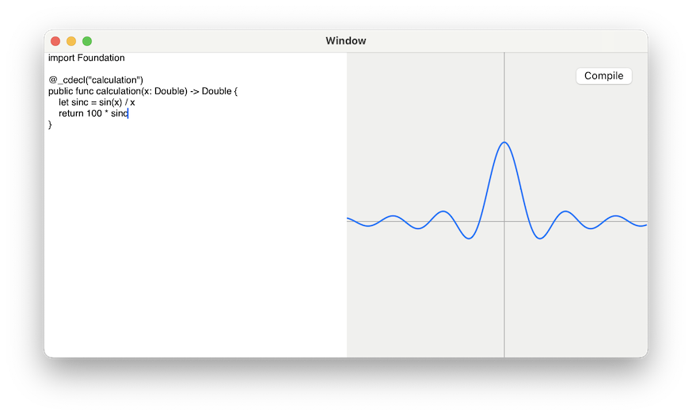

# SwiftGrapher

A graphing tool for macOS allowing you to write equations as Swift code. This is a very early work in progress.

> **NOTE:** Requires Swift to be installed at */usr/bin/*.

Works by compiling your code with `swiftc` to a dylib, and then linking at runtime.

## Roadmap
- [x] Zooming in the graph view
- [ ] Syntax highlighting
- [ ] Support multiple equations
- [ ] Display compiler errors
- [ ] Automatic compilation
- [ ] Hiding function attributes such as `@_cdecl` and `public`

## Tasks which might or might not make it
- [ ] Support computational commands like Intersect, Maxima, Minima, …
- [ ] Support other kinds of curves, like: parametric, radial, complex plane
- [ ] Support 3D graphs
- [ ] Separate version which embeds the Swift compiler

## Contributing

Contributions are welcome and encouraged. Feel free to check out the project, submit issues and code patches.
